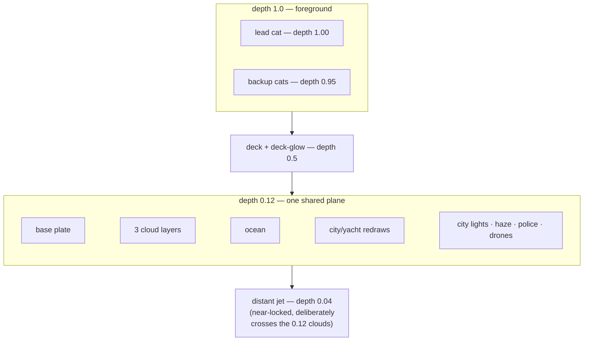
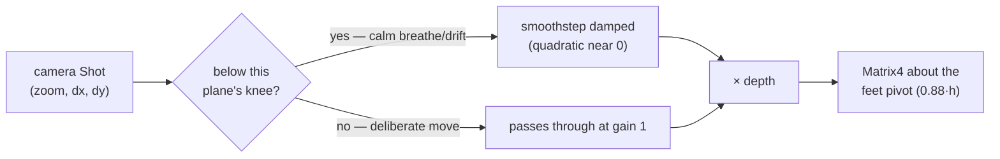

# Parallax and layers

The backdrop is a stack of flat, painted 2D images. There is no 3D geometry
behind it. What sells depth is **parallax**: when the camera moves, near
things move more (in screen pixels) than far things. This document explains
how that illusion is built, from the layer rig down to the exact transform
applied per frame, and the perceptual tuning ("soft-knee" biasing) that keeps
it from reading as swimmy or fake.

See [ADR 0001](../adr/0001-multiplane-parallax.md) for the original design
decision this document explains in more depth; the code has drifted from it
in one constant (noted below), which this doc treats as current truth.

## The depth rig: five coarse planes, not true 3D

A full per-object depth model (every building, every cloud, independently
placed in a Z axis) is the "correct" answer, but this scene's backdrop art
has a complication: the **master base plate already has the skyline, yacht,
and deck baked into it**. The city lights, the yacht redraw, the police
strobes, and so on are separate layers only so they can be *recolored and
recomposited* (graded, lit, animated) — not because they were painted at a
different depth than the plate under them. If one of those redraws
parallaxes independently of the base plate it painted over, it visibly slides
off its own baked twin — a doubled yacht, a ghosted skyline edge.

So the rig is deliberately **coarse**: everything that shares the base
plate's depth goes on *one* shared plane, and only the handful of elements
that are genuinely staged at a different depth — the deck the dancers stand
on, the distant crossing jet, the cast itself — get their own plane.



| Plane | `depth` | Why it's separate |
| --- | --- | --- |
| Lead cat | `1.00` | live-drawn, the reference plane everything else is judged against |
| Backup cats | `0.95` | live-drawn, a hair upstage of the lead |
| Deck + deck-glow | `0.5` | the foreground occluder the cast stands on |
| Everything painted (base plate, 3 cloud layers, ocean, city/yacht redraws, city lights, haze, police, both drone passes) | `0.12` | shares the base plate's depth — must never separate from its baked twin |
| Distant jet | `0.04` | dynamic, no baked twin; deliberately parked *nearer to locked* than the 0.12 clouds it visually crosses — an intentional depth inversion, since the jet reads as "impossibly far" regardless |

(The stage constant is `0.5` in code today; ADR 0001's original text says
`0.35` — it was raised back once the camera settled into slow, anticipated
dollies that no longer needed the extra damping. Constants: `_depthAircraft
= 0.04`, `_depthBackground = 0.12`, `_depthStage = 0.5` in
`lib/features/scenery/model/backdrop_scene.dart`.)

This is an explicit, documented trade-off: full per-object depth is deferred
until the art is "de-baked" into independent alpha layers. Until then, one
shared background plane is *correct* given how the art is painted, not a
shortcut.

## `ParallaxLayer`: a decorator, not a camera

The scenery code never imports anything camera-shaped. `ParallaxLayer` is a
thin decorator that wraps any other layer and asks its `BackdropContext` for
a transform:

```dart
class ParallaxLayer implements BackdropLayer {
  const ParallaxLayer(this.child, {required this.depth});
  final BackdropLayer child;
  final double depth; // 0 = locked at infinity … 1 = moves with the dancers

  @override
  void paint(Canvas canvas, BackdropContext ctx) {
    final matrix = ctx.parallaxForDepth?.call(depth, ctx.size);
    if (matrix == null) { child.paint(canvas, ctx); return; } // flat, no camera injected
    canvas..save()..transform(matrix.storage);
    child.paint(canvas, ctx);
    canvas.restore();
  }
}
```

If nobody has injected a `parallaxForDepth` closure into the context, the
layer paints flat — parallax is opt-in per render host, and scenery stays
testable/reusable without a live camera. The dance player injects the real
one; the closure computes a `Matrix4` from a camera **`Shot`** and a
**`depth`**.

## From a camera `Shot` to a per-plane matrix

A `Shot` is just three numbers: `({double zoom, double dx, double dy})`,
produced every frame by the camera director + rig (see
[`lib/features/character/README.md`](../../lib/features/character/README.md#virtual-camera--the-dance-director)
for how that shot itself is derived — this doc picks up once it exists).

`CharacterPainter.danceParallaxMatrixForShotAtDepth` turns one `Shot` into
one plane's transform:

```dart
static Matrix4 danceParallaxMatrixForShotAtDepth({
  required Shot shot, required Size size, required double depth, bool active = true,
}) {
  if (!active || size.isEmpty || depth <= 0) return Matrix4.identity();
  return _parallaxMatrix(
    _parallaxCameraAtDepth(shot, depth), size, _directorPivotFraction, scaleDy: true,
  );
}
```

A `depth <= 0` plane (the true-infinity case, not currently used but
supported) is identity — it never moves, by construction, not by tuning. Two
things happen before the matrix is built:

- **The shot is scaled down by depth.** A depth-`0.12` plane only receives
  12% of the foreground camera's zoom delta and pan — that's the whole
  parallax effect in one line: `zoom: 1 + zoomDelta * depth`,
  `dx: dx * depth`, `dy: dy * depth`.
- **The scaling pivots on the dancers' feet** (`_directorPivotFraction =
  0.88` of the frame height), the same pivot the foreground camera itself
  uses, so a push grows every plane *from the same anchor* — the ground
  plane never appears to slide sideways under a pure zoom.

The result is a clean **depth ladder**: tested to be monotonic (halving depth
never parallaxes *more* than full depth), always `zoom >= 1` (a plane only
ever grows about its pivot, never reveals an edge by shrinking), and never
exceeds the foreground camera's own zoom.

## Soft-knee biasing: why small moves don't swim

The linear depth ladder above is correct for *big, deliberate* camera moves —
a chorus push, a bridge traverse. But vection/motion-parallax research says
low-amplitude background motion reads as **more** objectionable per pixel
than the same fractional motion up close: a background plane that jitters by
even a couple of pixels during a calm establishing shot's gentle breathing
reads as swimming, long before the same jitter would bother anyone on the
foreground cast.

So every plane's small camera moves are passed through a **soft knee** — a
smoothstep ramp that damps motion below a threshold and passes it through
unchanged above it:

```dart
static double _softKnee(double x, double knee) {
  if (knee <= 0) return x;
  final t = (x.abs() / knee).clamp(0.0, 1.0);
  return x * t * t * (3 - 2 * t); // smoothstep: damped near 0, gain=1 at/after the knee
}
```

The knee itself **widens as the plane gets farther away**:

```dart
static ({double zoom, double dx, double dy}) _parallaxCameraAtDepth(Shot camera, double depth) {
  final farness = (1 - depth).clamp(0.0, 1.0);
  final zoomDelta = _softKnee(camera.zoom - 1, _kParallaxZoomKnee * farness);
  final dx = _softKnee(camera.dx, _kParallaxPanKnee * farness);
  final dy = _softKnee(camera.dy, _kParallaxPanKnee * farness);
  return (zoom: 1 + zoomDelta * depth, dx: dx * depth, dy: dy * depth);
}
```

`_kParallaxZoomKnee = 0.06`, `_kParallaxPanKnee = 60` (2560-reference
pixels). At `depth = 1` (the foreground cast) `farness = 0`, so the knee is
zero and every move passes through untouched. As depth drops toward `0.12`,
`farness` grows toward `~0.88`, widening the knee so that only the calm
establishing shot's small breathe/drift amplitude (`kCalmDriftRef = 35` ref
px, well inside the widened knee) gets damped — any *deliberate* framing
change (≥1.18 zoom, or ≥260px pan) clears the knee everywhere and rides the
plain linear ladder, full-strength, at every depth.



Because the knee only ever *shrinks* as depth increases, the softened output
stays monotonic in depth just like the un-softened ladder — a farther plane
never out-moves a nearer one, even inside the damped region.

## Cloud layers: intrinsic drift on top of shared parallax

The three cloud plates (`cloudsFar`/`cloudsMid`/`cloudsNear`) all sit on the
same `0.12` parallax plane — they must, to stay glued to the shared backdrop
under a camera move — but they also each carry their own **independent
drift** so they don't read as one frozen sky: `dxPerSecond` of `0.00165`,
`0.0021`, and `0.002775` respectively, plus per-layer vertical breathing
(`dyAmplitude`/`dyCycleSeconds`/`phase`). This is a second, orthogonal motion
source layered *inside* `CloudParallaxLayer`, composed after the shared
`ParallaxLayer` transform — camera parallax answers "how does this plane
respond to the camera," drift answers "what is this plane doing on its own."

## What's tested

`test/features/scenery/layers/parallax_layer_test.dart` covers the decorator
contract in isolation (flat when no camera injected; forwards exactly
`(depth, size)`; `save()`/`restore()` never leaks a transform to later
siblings). `test/features/character/runtime/character_painter_test.dart`
covers the actual math: identity edge cases, the linear ladder on deliberate
moves, the soft-knee asymmetry between near/far planes on calm moves, exact
pivot fixation, the flat-zoom-clamps-pan-to-zero case, and a 300-run
property test (`glados`) asserting the zoom scalar is always finite, always
`>= 1`, never exceeds the foreground shot's own zoom, and stays
depth-monotonic for arbitrary shots — not just the fixed examples above.
