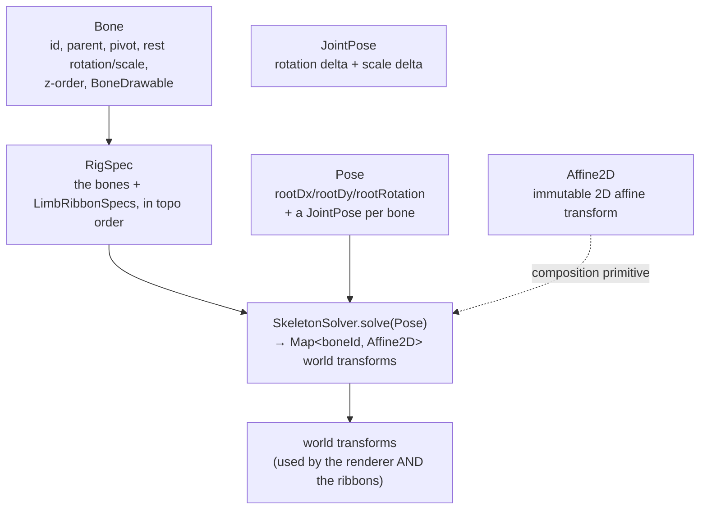
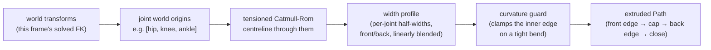

# Rig and deformable mesh

The character is a **2D skeletal rig**: a hierarchy of rigid bones, each
carrying a shape to draw, posed every frame by composing affine transforms
down the hierarchy (forward kinematics). On top of that rigid skeleton, a
small set of limbs render as **ribbons** — a continuous soft surface sampled
from the solved joint positions, which is what keeps elbows and knees from
reading as two capsules hinged together.

This document covers the rig model and the ribbon system. How limbs are
*kept* attached and in-range under animation (IK, joint limits, contact
anchoring) is [doc 3](03-limb-attachment-and-joint-constraints.md); this doc
is about the shapes and the transform math underneath all of that.

## The rig model



- **`Affine2D`** — an immutable 2×3 affine transform (rotation + non-uniform
  scale + translation). `multiply` composes `this ∘ other` (apply `other`
  first); `Affine2D.trs(pivotX, pivotY, rotation, scaleX, scaleY)` builds a
  transform that rotates/scales about a pivot.
- **`Bone`** — static rig data: an id, a parent id (or none, for the root),
  a **pivot** (the joint position, in the *parent's* local space), a rest
  rotation/scale, a z-order for paint ordering, and a `BoneDrawable` (shape,
  size, color) to render.
- **`Pose`** — the animated *delta* on top of rest: a root offset/rotation,
  plus one `JointPose` per bone (a rotation delta and a scale delta). This is
  what a `Clip` produces every frame — clips never touch bone geometry
  directly, only pose deltas.
- **`SkeletonSolver.solve(Pose)`** — walks the rig in topological order
  (parent always solved before any child) and composes each bone's world
  transform from its parent's:

```dart
Map<String, Affine2D> solve(Pose pose, {Affine2D base = Affine2D.identity}) {
  final world = <String, Affine2D>{};
  final rootBase = base
      .multiply(Affine2D.translation(pose.rootDx, pose.rootDy))
      .multiply(Affine2D.rotation(pose.rootRotation));

  for (final bone in rig.topoOrder) {
    final jp = pose.jointOf(bone.id);
    final local = Affine2D.trs(
      pivotX: bone.pivotX, pivotY: bone.pivotY,
      rotation: bone.restRotation + jp.rotation,
      scaleX: bone.restScaleX * jp.scaleX,
      scaleY: bone.restScaleY * jp.scaleY,
    );
    final parentWorld = bone.parent == null ? rootBase : world[bone.parent]!;
    world[bone.id] = parentWorld.multiply(local);
  }
  return world;
}
```

Every non-root bone's world transform is **unconditionally**
`parentWorld.multiply(local)`. The pivot offset (`pivotX`/`pivotY`) is fixed
rig data — animation only ever supplies a rotation/scale *delta* on top of
it. There is no code path in the solver that assigns a bone's world position
from anything other than its already-solved parent — which is the structural
reason a limb can never simply detach (more on the few *deliberate*,
pivot-preserving exceptions to this in doc 3).

`test/features/character/engine/skeleton_solver_test.dart` pins this with
hand-computed geometry: a child at rest pivot `(0, 10)` stays there exactly;
rotating the parent 90° swings the child's pivot to `(-10, 0)`; a `base`
transform (e.g. a camera placement) offsets every bone uniformly.

## Ribbons: a soft surface over a rigid chain

A rig drawn as raw capsules reads as cardboard hinged at each joint — visible
facets at the elbow, a hard seam at the knee. `LimbRibbonSpec` fixes this for
the limbs that need it (shoulder→elbow→wrist, hip→knee→ankle, the 7-link
tail) by replacing those segments' rigid drawables with **one continuous
surface**, resampled from the *solved* skeleton every frame.

This is deliberately **not** a skinned vertex mesh (the codebase has a
separate `SkinnedMeshSpec`/`skinned_mesh_solver.dart` for that, used for
garment panels). A ribbon is simpler: a **centerline spline through the
joints, extruded by a width profile**.



**Centerline.** A tensioned Catmull-Rom (Hermite) spline through the joint
world-origins named in `jointBoneIds`. Tension is authored per joint segment
(default `0.45`) and controls how much the curve smears a bend across the
whole limb versus resolving a crisp vertex at the joint: `0` is a fully
smoothed "boneless noodle," `1` is the raw joint polyline (a cardboard
hinge). A typical rig keeps the shoulder soft and firms up toward the elbow
so the limb still reads a bend where one is intended.

**Width profile.** At each sampled point along the spline, the half-width is
**linearly interpolated** between the two bracketing joints' authored
half-widths — independently for the "front" side (`halfWidths`) and an
optional "back" side (`backHalfWidths`), so a thigh can carry a front quad
bulge and a shin a back calf bulge without either side constraining the
other. Nothing in the code enforces "wider at joints" as a rule; it's
whatever the rig author sets per joint, blended smoothly between them.

**The self-intersection guard.** A tight bend (a crossed-wrist pose, a deep
knee flex) can make the naive inner-edge offset cross to the outer edge,
reading as a twisted wire instead of a folded limb. Before extrusion, the
solver estimates the local radius of curvature at each sample and clamps
that side's half-width to at most ~90% of it. If the clamp has to cut the
width below 70% of what was authored, the sample is flagged as a **crease**
— a separate ink-outline pass lifts its pen over creased samples instead of
drawing a line through the fold.

**Extrusion.** For each sample, `frontEdge = centre + normal·halfWidth`,
`backEdge = centre - normal·backHalfWidth` (the normal is the tangent
rotated 90°). The outline walks forward along every front edge, an optional
rounded cap, then back along every back edge, and closes — one filled `Path`
per limb.

## Why the ribbon can't drift from the bones

The renderer rebuilds the ribbon **from scratch every frame**, straight from
that frame's solved world transforms:

```dart
Path? _ribbonPath(LimbRibbonSpec ribbon, Map<String, Affine2D> world) {
  final spine = <Offset>[];
  for (final boneId in ribbon.jointBoneIds) {
    final transform = world[boneId];
    if (transform == null) return null;
    spine.add(Offset(transform.origin.x, transform.origin.y));
  }
  return limbRibbonPath(spine, ribbon.halfWidths, /* … */);
}
```

There is no caching or independent interpolation of the ribbon shape between
frames — it is a pure function of *this frame's* joint positions, so it is
geometrically inseparable from the skeleton: it cannot lag, drift, or
detach, because it is literally rebuilt from the bones' current world
origins on every paint call. `hiddenBoneIds` on the spec names the rigid
capsule drawables the ribbon replaces visually; terminal parts (hands, feet)
stay as separate rigid drawables layered on top of the ribbon's end.

## Two-pass paint (why joints don't show a seam)

Bones and ribbons paint in two passes, from
[`lib/features/character/README.md`](../../lib/features/character/README.md#per-frame-pipeline):
pass 1 paints every surface as a slightly inflated shape in one flat outline
color, so overlapping pieces union into a single continuous dark silhouette
— no outline can cross into the body at a joint, because there is no
per-piece outline at all at that stage. Pass 2 paints the real fills in
z-order on top, leaving only the outer rim dark. This is orthogonal to the
ribbon system (it applies to every drawable, ribbon or rigid) but is part of
why a rig built from discrete rigid pieces reads as one continuous body.

## What's tested

`test/features/character/model/affine2d_test.dart` pins composition order,
pivot rotation/scale, and matrix-buffer reuse. `skeleton_solver_test.dart`
(above) pins FK. `test/features/character/runtime/limb_ribbon_test.dart`
builds ribbon paths directly from hand-specified spine points (no rig
needed): a straight tapered chain's width matches the authored half-widths
at the caps and tapers correctly in between; a bent chain (`hip(0,0) →
knee(30,55) → ankle(0,110)`) stays one continuous filled region through the
bend; `roundCaps: false` produces flat ends; a degenerate single-point spine
returns an empty path without crashing.
