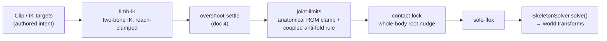
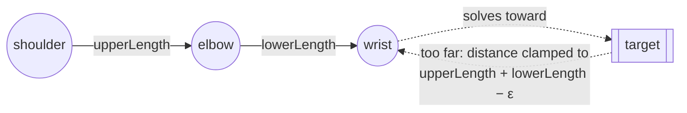
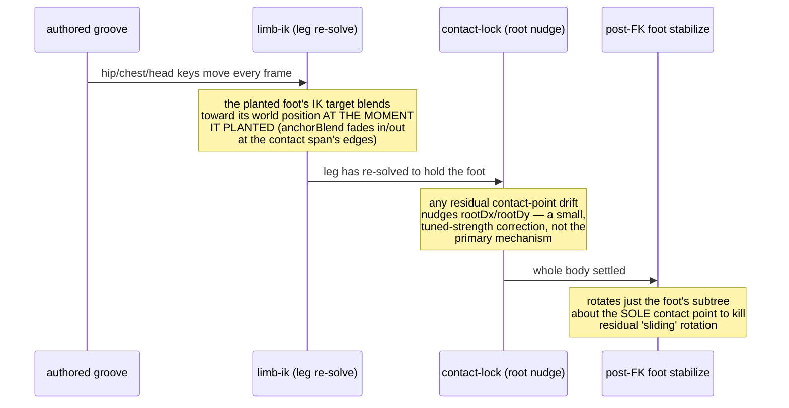

# Limb attachment and joint constraints

[Doc 2](02-rig-and-deformable-mesh.md) established that forward kinematics
makes a bone's world position structurally dependent on its parent's — a
limb cannot simply fall off. That guarantee covers *rigid attachment*, but
it says nothing about whether a pose is *anatomically plausible*: an elbow
could still be asked to bend backward, a wrist could be asked to fold
through the forearm, or a target for an IK-driven hand could sit somewhere
the arm physically cannot reach. This document covers the four mechanisms
that keep animated poses inside believable bounds, and how a planted foot
stays planted without breaking the leg above it.



This is the actual, test-enforced order of `CharacterScene`'s pose-modifier
pipeline. Every stage receives the *previous* stage's pose and returns a
(possibly corrected) pose — nothing here bypasses `SkeletonSolver`; every
correction changes the **input** to FK, never the output.

## Two-bone IK: reaching for a target without exploding

Hand and foot placement for dance choreography is often authored as a
**target point** (`LimbIkTarget`), not a joint rotation — "the paw goes
here," not "rotate the shoulder by this much." `solveTwoBoneIk` converts a
world-space target into upper/lower joint angles for a two-segment limb
(shoulder→elbow→wrist or hip→knee→ankle), using the classic analytic
law-of-cosines solution — not FABRIK, not an iterative solver, a closed-form
function of `(shoulder, target, upperLength, lowerLength, bendDirection)`:

```dart
final minReach = (upperLength - lowerLength).abs() + 1e-6;
final maxReach = upperLength + lowerLength - 1e-6;
final solvedDistance = targetDistance.clamp(minReach, maxReach);
final targetAngle = math.atan2(toTargetY, toTargetX);
final shoulderCos = (upperLength*upperLength + solvedDistance*solvedDistance - lowerLength*lowerLength)
    / (2 * upperLength * solvedDistance);
final shoulderOffset = math.acos(shoulderCos.clamp(-1.0, 1.0));
final upperAngle = targetAngle + bendDirection * shoulderOffset;
```



The reach guard is the load-bearing safety net: `targetDistance` (the real
distance to the target) is clamped to `[minReach, maxReach]` **before** any
trigonometry runs, so a target 100 units away with only 7 units of total
reach makes the limb straighten to (just under) full extension and point at
the target — the effector does not travel the full 100 units, and nothing
divides by zero or produces `NaN`. `shoulderCos.clamp(-1.0, 1.0)` guards
`acos` against floating-point overshoot at the reach extremes for the same
reason. `bendDirection` (±1) is the one purely *choreographic* input — it
picks which side of the shoulder→target line the elbow bends toward, and
carries no physical constraint of its own.

A 300-run property test
(`test/features/character/engine/two_bone_ik_test.dart`) asserts the solver
reaches any target strictly inside `[minReach, maxReach]` to `1e-6`, and a
dedicated case (`'a target beyond reach straightens the limb to its max
reach'`) confirms the clamped, non-exploding behavior above.

IK never writes a world position directly: `CharacterScene._solveLimbTarget`
converts the solved world-space angles back into ordinary **local**
`JointPose.rotation` values (subtracting the parent's already-solved world
rotation and the bone's rest rotation), so the IK result re-enters the pose
as if a clip had authored it, and flows through the exact same FK path as
everything else.

## Anatomical rotation limits: the final safety net

`JointRotationLimit(min, max)` (radians, on top of rest pose) is an optional
field on every `Bone`. `clampAngle` wraps the rotation into `(-π, π]`,
clamps it, then re-applies the correction to the *original* value so a
legitimately-wrapped IK solution (e.g. just past ±π) isn't corrupted:

```dart
double clampAngle(double rotation) {
  var wrapped = rotation % (2 * math.pi);
  if (wrapped > math.pi) wrapped -= 2 * math.pi;
  if (wrapped <= -math.pi) wrapped += 2 * math.pi;
  final clamped = clamp(wrapped);
  return rotation + (clamped - wrapped);
}
```

The shipped rig's real ranges (radians, animated delta only — rest pose is
the zero point):

| Joint | Range | Notes |
| --- | --- | --- |
| Knee (`legLowerL`/`R`) | `[-2.7, 0.1]` | deep flexion allowed (~155°); extension capped near zero so it can never bend backward. The authored catalogue only ever uses `[-1.70, +0.02]` — the runtime range is set looser on purpose, as a true safety net rather than a tight fence. |
| Ankle/foot (`footL`/`R`) | `[-1.25, 1.25]` | ~±71.6° |
| Elbow (`armLowerL`/`R`) | `[-2.9, 2.9]` | ~±166° — wide because in a 2D rig either bend side is a legal stand-in for humeral rotation, which the rig has no separate axis for |
| Wrist (`handL`/`R`) | `[-1, 1]` | ~±57° |

This clamp runs in the pipeline's `joint-limits` stage, **after** IK and
**after** the overshoot-settle pass (doc 4) — deliberately last among the
per-joint corrections, so it is the final word regardless of what produced
the rotation: an out-of-range clip keyframe, a wild IK solution, or a
settle-pass overshoot all get corrected the same way, every frame.

## The coupled anti-fold rule: catching poses no single joint limit can

A per-joint range can't catch an *impossible combination* where every joint
individually sits inside its own range — e.g. elbows pinched tight at the
sternum with the forearms flared outward past what the upper arm's position
allows. `CharacterScene.armFoldCorrections` computes the upper arm's
world-space **adduction** (how tucked-in it is against the body) and derives
an *allowance* for how far the forearm may fold, given that adduction:

```dart
static const double _kArmFoldNeutralLateralFlex = 2.6;
static const double _kArmFoldAdductionSlope = 4;
static const double _kArmFoldAdductionCutoff = 1.55;

final allowance = math.max(0,
    _kArmFoldNeutralLateralFlex - _kArmFoldAdductionSlope * math.max(0, adduction),
  ) + math.max(0, (adduction - 1.15) * 2.2);
```

If the forearm's actual relative bend exceeds `allowance`, the rule emits a
corrective delta to the elbow's local rotation — choosing the boundary the
elbow's own `JointRotationLimit` can actually reach, so the per-joint clamp
that runs immediately after doesn't just drag the correction straight back
into the illegal arc. This runs *before* the per-bone clamp in the
`joint-limits` stage.

A companion offline tool, `motion_constraint_validator.dart`, audits
*authored* clips against these same limits (comparing a clip's raw pose to
its post-clamp pose): any difference means the choreography leaned on the
runtime limiter to stay legal instead of being authored inside the range in
the first place — useful as a "how close to the fence is this move" signal
during authoring, separate from the runtime enforcement itself.

## Support-foot anchoring: three layers, not one whole-body translate

A dance clip's groove (hips, chest, head) moves the body every frame; a
planted foot must **not** move with it, or it reads as sliding on the deck.
Fixing this with one crude whole-body counter-translation would work for the
foot but drag every other limb along for the ride, breaking hand
placements. The actual mechanism is three cooperating layers, applied at
different pipeline stages:



1. **Leg IK re-solve toward the anchor point** (`limb-ik` stage,
   `Clip.contactSpans` + `Clip.supportFootWorldAnchor`). The clip is
   evaluated at the contact span's anchor phase to capture where the foot
   bone's origin was the instant it planted; the leg's authored IK target is
   then blended toward that fixed world point by `anchorBlend`, which fades
   in and out at the span's edges (`fade = (spanLength * 0.24).clamp(0.05,
   0.09)`, smoothstep) so a hold never engages at full strength instantly —
   "a hard hold narrows the astride into a leg-tangle." This is a genuine
   IK re-solve: the hip/knee/ankle chain bends via `solveTwoBoneIk` to reach
   the fixed point while the rest of the groove keeps moving above it.
2. **Whole-body root nudge** (`contact-lock` stage, after `joint-limits`).
   Compares the foot's *contact point* (the sole, not the ankle pivot)
   between the current pose and the anchor-phase pose, and nudges
   `rootDx`/`rootDy` by the strength-scaled residual. This catches whatever
   the leg IK alone didn't fully absorb — a secondary correction layered on
   top of (1), not the primary mechanism.
3. **Post-FK foot-orientation stabilization**, applied to the already-solved
   world transforms (not a pose-modifier stage): rotates just the foot bone
   and its descendants about the sole contact point to hold the foot's
   world *orientation* steady through the stable middle of a contact,
   killing residual rotational "sliding on a deck" that the leg keys would
   otherwise still impart. Gated tight (only engages when the correction
   would exceed ~0.01 rad and contact strength is above 0.05) and never
   touches the ankle's ancestors, so the leg above is untouched by this
   pass.

Measured effectiveness
(`test/features/character/runtime/character_scene_test.dart`): a one-shot
clip's locked drift is held under 45% of its raw (unlocked) drift and under
12px absolute; a looping performance clip holds vertical drift under 8.5px
and lateral under 38px (lateral is deliberately allowed more — "glide with
the groove" reads better than a rigidly frozen foot); the opt-in
world-anchor keeps horizontal drift under 20px across a local hold window.

## Summary: what's structural vs. what's enforced vs. what's authored

| Guarantee | Mechanism | Enforced how |
| --- | --- | --- |
| A limb cannot detach from its parent | Forward kinematics (doc 2) | Structural — there is no code path around it |
| A limb cannot ask for an unreachable target | Two-bone IK reach clamp | Runtime, every solve |
| A joint cannot rotate past its anatomical range | `JointRotationLimit.clampAngle` | Runtime, every frame, last in the pipeline |
| Elbow/shoulder combinations can't fold through the body | `armFoldCorrections` | Runtime, every frame, before the per-joint clamp |
| A planted foot doesn't skate | Leg IK anchor blend + root nudge + orientation stabilize | Runtime, opt-in per clip via `contactSpans`/`supportFootWorldAnchor` |
| A clip's authored motion stays inside "sensible" ranges to begin with | Choreography authoring practice | Not enforced at runtime — audited offline by `motion_constraint_validator.dart` |
