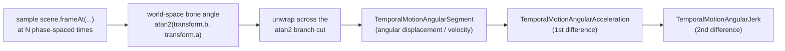
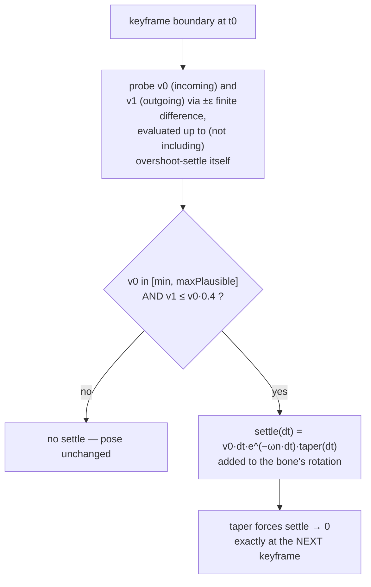

# Temporal motion constraints

[Doc 3](03-limb-attachment-and-joint-constraints.md) covers *where* a joint
is allowed to be — its anatomical range. That's necessary but not
sufficient: a joint can stay entirely inside its legal range while still
**snapping** — rotating so fast, or stopping so abruptly, that it reads as a
glitch rather than a dance move. This document covers the newest layer of
the system (shipped in `feat(character): angular motion diagnostics +
overshoot-settle`, PR #22): measuring rotation *rate*, and shaping what
happens in the instant after a hard authored stop.

Nothing in `lib/features/character/README.md` describes this system yet —
this doc is the first place it's explained end to end. There is no ADR for
it either; the design rationale below is reconstructed from the shipping
commit's own (unusually detailed) message and confirmed against the code
and tests.

## Two distinct mechanisms, easy to conflate

It's worth being explicit up front, because the names are easy to mix up:

- **Angular motion diagnostics** (`TemporalMotionAnalyzer`) *measures*
  rotation rate after the fact and is consumed by a **test-time gate** — it
  is not a runtime constraint. Nothing at render time reads it.
- **Overshoot-settle** is a **runtime pose-modifier pass** that adds a
  decaying rotational follow-through after a hard authored stop. It runs on
  every frame, live.
- **`Ease.easeOutBack`** (mentioned in doc 3 and the main README) is a third,
  older, unrelated thing: an authored *keyframe easing curve* a choreographer
  opts an individual IK-target channel into, by hand, per clip. Overshoot-
  settle is generic and always-on for a fixed set of bones; `easeOutBack` is
  per-channel and explicit. Don't conflate the two.

## Measuring rotation rate: `TemporalMotionAnalyzer`

The analyzer already existed for *positional* jerk diagnostics
(displacement → acceleration → jerk on `dx`/`dy`, sampled from resolved
world-space bone positions across a clip). This system adds the same
three-stage chain for **angle**:



Two design choices matter:

- **World-space angle, not local `JointPose.rotation`.** A forearm's visual
  rotation compounds its parent's rotation too — world angle is what a
  viewer actually perceives as "snapping," so that's what's measured:
  `math.atan2(transform.b, transform.a)` on the bone's fully resolved
  `Affine2D` (after clip evaluation, IK, contact pinning, head
  stabilization — everything the renderer actually sees).
- **Unwrapped accumulation**, to avoid a false ~2π spike every time a
  rotation crosses the `atan2` branch cut:

```dart
final rawAngle = math.atan2(currentTransform.b, currentTransform.a);
final wrappedDelta = _wrapToPi(rawAngle - _wrapToPi(previousUnwrapped));
final unwrappedAngle = previousUnwrapped + wrappedDelta;
```

`TemporalMotionReport` exposes `worstAngularVelocity` /
`worstAngularAcceleration` / `worstAngularJerk` and matching `topN`
accessors, each entry carrying the bone id and the exact frame/phase pair —
so a violation is traceable to "this bone, between these two frames," not
just a scalar. The analyzer itself carries **no built-in thresholds** — same
as its pre-existing positional queries — it is a measurement object; the
caller decides what "too fast" means.

## The test-time gate

`test/features/character/runtime/dance_angular_motion_test.dart` is that
caller, and the only one. For every catalogue clip (`shaku`, `zanku`,
`azonto`, `sekem`, `buga`, `pouncingCat`) and bones `handL`, `handR`,
`torso`, it samples 192 frames and asserts:

```dart
expect(worstVelocity * kDanceRealTempoSpeedup, lessThan(2.5));       // rad/sample
expect(worstAcceleration * speedupSquared, lessThan(1.5));           // rad/sample²
```

This is a **CI test gate**, not a runtime clamp — there is no code path
anywhere in `SkeletonSolver`, `ClipEvaluator`, or `CharacterScene`'s
pose-modifier pipeline that enforces a velocity or acceleration ceiling at
render time. If a clip is authored to snap, nothing at runtime stops it;
the test simply fails to merge it.

### Why the numbers get multiplied by 1.5 and 2.25

```dart
const double kDanceRealTempoSpeedup = 6 / 4; // = 1.5
```

Clips are authored on a fixed 6-second clock, but the live app re-maps clip
time onto the *real* track's detected beat grid
(`BeatLoopBinding.barAligned`) — at the sample track's 120 BPM, an 8-beat
loop takes `8 * 60 / 120 = 4` real seconds, so the shipped app actually
plays every routine **1.5× faster** than the raw clip clock every earlier
smoothness test silently measured against. Since compressing time by factor
`k` scales the n-th time-derivative by `k^n`, the test scales velocity
readings by `1.5` and acceleration readings by `1.5² = 2.25` before
comparing to the ceiling — so the gate reflects what a viewer actually sees
in the running app, not the slower authored clock. This constant is
explicitly documented as *this track's* current factor, not a universal
one — it would need recomputing if the sample track or the loop length
(`kDancePhraseBars`) changes.

Thresholds were calibrated against `sekem` — "the reference clip nobody has
flagged as snappy" — with roughly 3–4× headroom above its own worst
readings.

### What tripped the gate, and how it was actually fixed

Worth recording because it's a useful lesson in reading this kind of
diagnostic: the gate's first run flagged real-looking violations in `zanku`,
`azonto`, and `pouncingCat`. The root cause in every case was **not**
genuinely fast choreography — it was the two-bone IK solver's near-degenerate
reach zone (an arm folded to within ~12% of its shoulder-to-hand reach),
which makes the solved bend angle flip abruptly between adjacent samples: a
solver artifact that reads as a spike in the diagnostic but isn't real
motion. The fix was in the choreography data, not the engine — widening the
IK-target reach at the offending keyframes in `cat_in_suit.dart` so the
solver never entered that near-degenerate zone. One case (`azonto`'s
frame 30→31) needed a different fix: a shoulder-corrective ramp
(`_shoulderCorrectiveEngagement`) was crossing its engagement threshold in a
single frame; spreading that ramp across two frames removed the spike.

## Overshoot-settle: shaping the instant after a hard stop

This is the one genuinely new runtime pass. It's wired into
`CharacterScene`'s pose-modifier pipeline between `limb-ik` and
`joint-limits` (see [doc 3](03-limb-attachment-and-joint-constraints.md)'s
pipeline diagram):

```dart
PoseModifierPass(
  id: 'overshoot-settle',
  description:
      'Add a decaying rotational settle after a hard authored stop on '
      'arm/torso channels, scaled to how fast the incoming motion was '
      'moving. Runs before joint-limits so the clamp remains the final '
      'safety net.',
  modifier: _overshootSettledPose,
),
```

### The idea

A dance move often keys a fast swing into a hard, held stop — a punch, a
presenting arm. Cutting the angular velocity to zero exactly on the
keyframe is *physically* what the authored data says, but it reads as
robotic: real limbs carry momentum and settle. Overshoot-settle adds that
settle back in automatically, without touching the authored keyframes.

### The formula

The injected term is the **closed-form response of a critically-damped
spring-damper to an initial velocity impulse** — deliberately the
non-oscillating form (one rise-and-decay hump, never a ring/wobble):

```dart
final settle = v0 * dt * math.exp(-_kOvershootOmegaN * dt) * taper;
```

`v0` is the bone's angular velocity going *into* the stop; `dt` is time
since the keyframe boundary. `t · e^(-ωt)` rises from zero, peaks once, and
decays back to zero — a single follow-through, not a bounce.

| Constant | Value | Meaning |
| --- | --- | --- |
| `_kOvershootOmegaN` | `11` rad/s | how fast the follow-through hump rises and decays — tuned by feel, not derived from frame rate |
| `_kOvershootMinIncomingSpeed` | `6` rad/s | incoming speed must clear this before a settle triggers at all — well above ordinary authored motion, so smooth clips (e.g. `sekem`) never trigger it |
| `_kOvershootMaxOutgoingRatio` | `0.4` | only counts as a "hard stop" if outgoing speed drops to ≤40% of incoming speed |
| `_kOvershootMaxPlausibleSpeed` | `25` rad/s | above this, a finite-difference reading is discarded as two-bone-IK solver noise, not real motion — "no authored choreography swings an arm this fast" |
| `_kOvershootProbeEpsilon` | `1/480` s | the finite-difference probe step used to sample velocity either side of a keyframe boundary |

`taper = 1 - dt / frameDuration` is a **linear taper to exactly zero at the
next authored keyframe boundary**, on the fixed 32-frame choreography grid
(`frameDuration = clip.duration / 32`). This is what guarantees the settle
never perturbs an *authored instant* — every exact-frame pose assertion
elsewhere in the test suite is untouched, because by construction the term
is zero at every keyframe regardless of the spring tuning above it.



### Which bones, and why feet are excluded

`_overshootTargetBoneIds(clip)` derives the bone set from the clip's own
data, not a hardcoded list: for every `LimbIkTarget` whose end effector is
*not* a declared ground/contact bone (i.e. a hand, not a support foot), both
its upper and lower segment bones are included; the torso is added if the
rig declares a chest. **Feet are explicitly excluded** — "softening a
support foot's arrival reads as sliding into contact rather than landing,"
which would directly fight the contact-anchoring work in
[doc 3](03-limb-attachment-and-joint-constraints.md#support-foot-anchoring-three-layers-not-one-whole-body-translate).

### Stateless by design

The pass stores no per-frame integration state — it's a pure function of
`timeSeconds`, re-deriving `v0`/`v1` from a probe every time it's evaluated.
Scrubbing to any timestamp reproduces the same result, which is what keeps
the film-strip renderer's byte-identical-output guarantee intact.

### It composes with, but doesn't replace, the joint-limit clamp

Overshoot-settle runs *before* `joint-limits` in the pipeline specifically
so that an injected overshoot can never push a joint past its anatomical
range — the clamp from [doc 3](03-limb-attachment-and-joint-constraints.md#anatomical-rotation-limits-the-final-safety-net)
remains the actual final word regardless of what the settle pass adds.

### What it did and didn't fix

Worth being honest about, from the shipping commit's own notes: the pass's
net effect on the shipped catalogue is small. The real "snap energy" the
angular-motion gate above was catching lived mostly in the lower-arm/elbow
channel — the two-bone IK solver's most volatile output near a degenerate
reach — which was excluded from the settle pass's target set in its first
cut (to avoid amplifying solver noise), then re-included once
`_kOvershootMaxPlausibleSpeed` was added as a guard. Even after that, the
commit notes the pass "measurably helps zanku hand.L's *position* jerk but
doesn't move these specific worst-case *rotation* readings" — i.e. the
overshoot-settle pass and the angular-motion test gate are **not causally
coupled**. The gate's actual failures were fixed by widening IK reach in the
choreography data (previous section), not by this pass. Overshoot-settle is
a genuine perceptual improvement to how a hard stop *reads*; it is not the
mechanism that made the angular-motion gate pass.

## What's tested

`test/features/character/runtime/dance_angular_motion_test.dart` — the gate
itself, exact thresholds and scaling above.
`test/features/character/runtime/temporal_motion_analyzer_test.dart` —
analyzer construction/accessor behavior on empty and populated data.
`test/features/character/runtime/character_scene_test.dart` — the pipeline's
enforced stage order includes `overshoot-settle` between `limb-ik` and
`joint-limits`.
