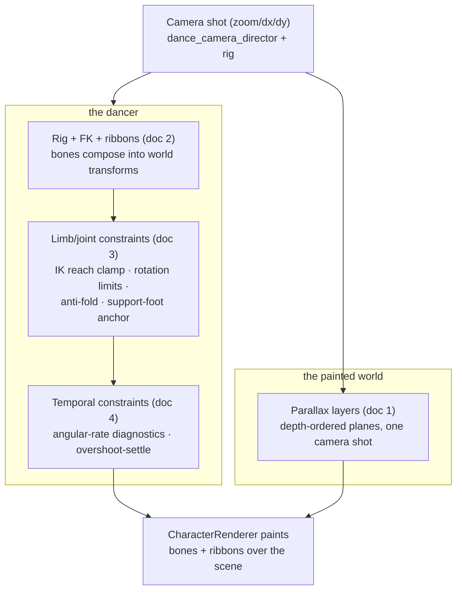

# Animation concepts

A concept-first companion to [`lib/features/character/README.md`](../../lib/features/character/README.md)
(the architecture reference) and [`lib/features/scenery/README.md`](../../lib/features/scenery/README.md).
Those files describe *what is built*; this series explains *how the underlying
techniques work* and *why they were built that way*, independent of any one
feature's day-to-day status table.

Four documents, each self-contained but building on the previous one:

1. **[Parallax and layers](01-parallax-and-layers.md)** — how a flat painted
   scene reads as deep when the camera moves: the depth-plane rig, the
   per-depth transform, and the "soft-knee" biasing that keeps distant planes
   from swimming.
2. **[Rig and deformable mesh](02-rig-and-deformable-mesh.md)** — the
   skeleton: bones, pivots, forward kinematics, and the ribbon system that
   turns a chain of rigid bones into a continuous soft limb surface.
3. **[Limb attachment and joint constraints](03-limb-attachment-and-joint-constraints.md)** —
   why a limb can never detach or fold through itself: two-bone IK and its
   reach clamp, anatomical rotation limits, the coupled anti-fold rule, and
   how a planted foot stays planted without breaking the leg above it.
4. **[Temporal motion constraints](04-temporal-motion-constraints.md)** — the
   newest layer: measuring how *fast* a bone is allowed to rotate
   (angular velocity/acceleration diagnostics) and what happens immediately
   after a hard authored stop (the overshoot-settle pass).

## How the four fit into one frame

Both halves read the **same camera shot** every frame — the scene through
`ParallaxLayer`'s per-depth transform, the dancer through ordinary screen
placement — which is why a camera move reads as one coherent 3D-ish push
instead of a flat cutout sliding over a flat backdrop. Docs 1 and 2–4 can be
read independently; doc 4 assumes doc 3's pipeline ordering.

## Where the code actually lives

| Concept | Primary files |
| --- | --- |
| Parallax layers | `lib/features/scenery/layers/parallax_layer.dart`, `lib/features/scenery/model/backdrop_scene.dart`, `lib/features/character/runtime/character_painter.dart` (`danceParallaxMatrixForShotAtDepth`) |
| Rig / FK / ribbons | `lib/features/character/model/bone.dart`, `lib/features/character/model/affine2d.dart`, `lib/features/character/engine/skeleton_solver.dart`, `lib/features/character/runtime/limb_ribbon.dart` |
| Limb / joint constraints | `lib/features/character/engine/two_bone_ik.dart`, `lib/features/character/model/bone.dart` (`JointRotationLimit`), `lib/features/character/runtime/character_scene.dart` (`armFoldCorrections`, `_contactLockedPose`, `_limbTargetedPose`) |
| Temporal motion constraints | `lib/features/character/runtime/temporal_motion_analyzer.dart`, `lib/features/character/runtime/character_scene.dart` (`_overshootSettledPose`), `test/features/character/runtime/dance_angular_motion_test.dart` |

These docs cite exact constants and function names so they stay checkable
against the source; if a number here ever disagrees with the code, the code
wins — treat the mismatch as this doc going stale, not the other way round.
